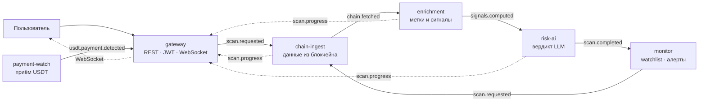
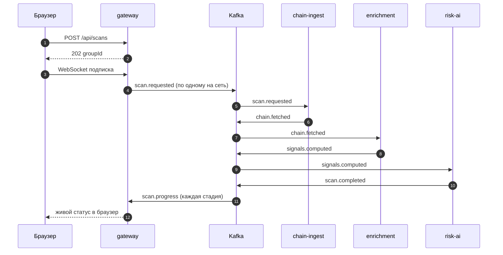
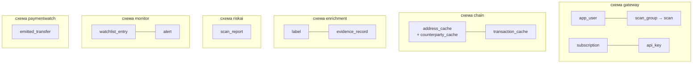

# risk-scoring — как устроена система

**Оценка риска криптоадресов · микросервисы на Kafka · LLM в ядре**

---

## Адрес на входе — объяснённый вердикт на выходе

Пользователь вводит адрес кошелька или хеш транзакции. Система сама идёт в блокчейн, собирает
историю переводов, строит граф связей, сверяет участников с санкционными списками, считает
риск-сигналы и отдаёт собранные доказательства языковой модели. Обратно приходит **уровень риска,
числовой скор и объяснение, какие именно сигналы решили исход**.

| | |
|---|---|
| **Сервисов** | 6 + модуль контрактов |
| **Сетей** | 13 в 5 семействах |
| **Топиков Kafka** | 9 активных |
| **Тестов** | 150 классов |
| **Схем в БД** | 6, по одной на сервис |

Это обзорный документ — вся система на одной странице. Детальные разборы по темам —
в остальных файлах каталога `docs/`, оглавление в [README.md](README.md).

---

## 1. Что решает продукт

Обычный чат с языковой моделью не может ответить на вопрос «это скам-адрес?» — у него нет доступа
ни к ончейн-данным, ни к санкционным спискам. Он либо откажется, либо придумает ответ.

У нас доступ есть. Ценность складывается из двух вещей:

- **Собранные доказательства** — реальная история переводов, граф контрагентов на два хопа,
  ежедневно обновляемый список OFAC SDN, курируемые списки миксеров и бирж.
- **Рассуждение модели поверх них** — не формула с весами, а взвешивание противоречивых сигналов
  с объяснением на человеческом языке.

> **Зачем здесь именно LLM.** У адреса одновременно: 34 % объёма прошло через миксер и есть один
> хоп до санкционного адреса — но кошелёк старый, активный, половина контрагентов это hot-wallet
> крупных бирж. Формула на весах здесь либо даст ложное срабатывание, либо пропустит реальный риск.
> Модель должна сказать, **что именно перевесило и почему**.

### Миксер — это не санкции

Tornado Cash убран из списка OFAC в марте 2025: суд решил, что неизменяемые смарт-контракты
блокировать нельзя. «Адрес под санкциями» и «известный миксер, под санкциями не находящийся, но всё
ещё сигнал отмывания» — два разных утверждения с разными последствиями. Продукт различает их и в
данных, и в промпте модели.

### Шкала вердикта

| Уровень | Скор |
|---|---|
| LOW | 0–25 |
| MEDIUM | 26–50 |
| HIGH | 51–80 |
| CRITICAL | 81–100 |

Скор проверяется на согласованность с уровнем: ответ «CRITICAL, 62» отклоняется и переспрашивается.
Одна палитра риска используется сквозь весь продукт — консоль, отчёт, watchlist, дашборд.

---

## 2. Архитектура

Шесть независимых сервисов, которые **не вызывают друг друга напрямую**. Каждый слушает свою очередь
в Apache Kafka, делает свою часть работы и кладёт результат в следующую очередь. Синхронный HTTP есть
только между браузером и gateway.



| Сервис | За что отвечает | Файлов |
|---|---|---:|
| `gateway` | Единственная точка входа: REST API, авторизация, WebSocket-стрим, история, watchlist-API, биллинг, API-ключи | 241 |
| `chain-ingest` | Данные из блокчейнов, граф контрагентов на 1–2 хопа, кэш | 183 |
| `enrichment` | Сверка со списками меток, расчёт риск-сигналов, сборка доказательств | 42 |
| `risk-ai` | Промпт, вызов модели, валидация вердикта — единственное место с LLM | 34 |
| `monitor` | Watchlist, перепроверка по расписанию, алерты | 30 |
| `payment-watch` | Приём оплаты в USDT напрямую из блокчейна | 22 |
| `common` | Только контракты: 11 классов событий и 26 моделей. Ни логики, ни доступа к БД | 38 |

### Что даёт событийная архитектура

- Запрос пользователя возвращается за миллисекунды, а работа — несколько внешних API плюс вызов
  модели — идёт в фоне.
- Падение одного сервиса не роняет цепочку: сообщения дождутся его возвращения.
- Ручной скан и автоматическая перепроверка из watchlist используют **один и тот же конвейер** —
  без дублирования кода.
- Каждый шаг транслируется в браузер в реальном времени, а не прячется за спиннером.
- Топики по 3 партиции: любой консьюмер масштабируется до трёх копий без изменений в коде.

---

## 3. Kafka: поток событий

Имена топиков — константы в модуле `common`, там же живут классы событий. Продюсер и консьюмер
используют один и тот же тип, поэтому контракт не может разъехаться незаметно.

| Топик | Публикует | Читает |
|---|---|---|
| `scan.requested` | gateway, monitor | chain-ingest, gateway |
| `chain.fetched` | chain-ingest | enrichment |
| `signals.computed` | enrichment | risk-ai |
| `scan.completed` | risk-ai | monitor |
| `scan.progress` | все стадии конвейера | gateway → WebSocket |
| `watchlist.add.requested` | gateway | monitor |
| `watchlist.remove.requested` | gateway | monitor |
| `usdt.payment.detected` | payment-watch | gateway |
| `alert.triggered` | monitor | *потребителя пока нет* |

### Надёжность

- **Ретраи:** две повторные попытки с паузой 5 секунд. Исключения, которые повторять бессмысленно
  (неизвестная сеть, адреса не существует), помечены явно и не ретраятся.
- **Пользователь узнаёт об отказе:** при окончательной неудаче публикуется прогресс со стадией
  `FAILED` и внятной причиной — вместо вечного спиннера.
- **Идемпотентность:** повторная доставка события не вызывает LLM второй раз, не дублирует скан и
  не засчитывает платёж дважды.
- `acks: all` у продюсеров, безопасная десериализация с ограничением доверенных пакетов.

---

## 4. Путь скана



**gateway — приём и разбор цели.** Строка прогоняется через форматы всех семейств сетей. Это
принципиально неоднозначно: `0x` + 64 hex — это и транзакция EVM, и адрес SUI; голые 64 hex —
транзакция Bitcoin, TRON или TON. Поэтому возвращается **список кандидатов**, а сеть выбирает
пользователь. Один запрос = группа сканов, по одному на сеть. Если сети не указаны — веер по всем
подходящим. Анонимный запрос ограничен одной сетью и 10 запросами в час с IP.

**chain-ingest — сбор ончейн-данных.** Клиент данных выбирается по паре (семейство сети, тип цели) —
10 реализаций, добавление сети это новый бин, а не ветка `if`. Сначала проверяется кэш со сроком
6 часов, и только потом идёт запрос к внешнему API. Строится граф контрагентов: первый хоп целиком,
затем топ-3 разворачиваются на второй хоп; итог обрезается до 25 адресов с резервом 5 мест под
второй хоп.

**enrichment — метки и риск-сигналы.** Все участники сверяются со списками меток одним запросом в
базу, считаются эвристики, собирается пакет доказательств. LLM здесь не участвует — только
детерминированные проверки и арифметика.

**risk-ai — вердикт.** Собирается промпт, вызывается модель, ответ валидируется. При некорректном
ответе — переспрос с указанием ошибки, до трёх попыток. Вердикт вместе с полным пакетом
доказательств сохраняется в базу.

### Живая консоль — не украшение

Каждая стадия дополнительно публикует событие прогресса. Gateway переводит его на язык пользователя
и пушит в браузер по WebSocket. Экран печатает строки одну за другой, как лог терминала:

```
› тяну данные из чейна…
✓ нашёл 128 транзакций, 25 контрагентов
› обогащаю…
✓ обнаружена экспозиция к миксеру 34 %
› AI анализирует…
✓ готово — HIGH · 78
```

> **Почему это важно.** Каждая строка — **реальное событие Kafka**, прошедшее через конвейер. Экран
> буквально показывает работу событийной архитектуры, поэтому он сделан как первоклассная фича, а не
> как индикатор загрузки.

---

## 5. Откуда берутся данные

Единого API, который умеет все сети, не существует. У каждого семейства свой источник, выбранный по
конкретной причине.

| Семейство | Сети | Источник | Хопов |
|---|---|---|---:|
| EVM | Ethereum, BNB Smart Chain, Polygon, Arbitrum, Base, OP Mainnet, Avalanche, Gnosis, Linea | Moralis Web3 Data API | 2 |
| BITCOIN | Bitcoin | mempool.space | 1 |
| SOLANA | Solana | Helius | 2 |
| TRON | TRON | TronGrid | 2 |
| TON | TON | TonAPI | 2 |
| SUI | Sui — `PLANNED` | нет проверяемых списков меток | — |

### Решения, которые стоят за таблицей

- **Bitcoin не через Moralis:** история кошелька там premium-эндпоинт, а данные mempool.space
  полнее — пожизненный счётчик транзакций и полные входы/выходы, без которых UTXO-граф не построить.
- **Solana не через Moralis:** балансы есть, общей истории транзакций по кошельку нет — граф
  контрагентов строить не из чего.
- **Bitcoin ограничен одним хопом:** источник бесплатный и отвечает отказом при нагрузке, а в
  UTXO-сети одна транзакция даёт сразу много контрагентов.
- **Кэш на 6 часов — про квоту, а не про скорость:** тариф Moralis считает вызовы, а не сети,
  поэтому веер по девяти EVM-сетям без кэша сжёг бы дневной лимит за несколько сканов.

> **Неочевидная ловушка.** Приведение адреса к нижнему регистру применяется **только к EVM**. Адреса
> Bitcoin, TRON и Solana записаны в base58, TON — в base64url; там регистр значим, и «нормализация»
> ломает адрес.

---

## 6. Метки и риск-сигналы

| Категория | Источник | Как влияет |
|---|---|---|
| `SANCTION` | OFAC SDN, автосинхронизация ежедневно в 03:00 | жёсткий флаг |
| `MIXER` | курируемый список | мягкий флаг |
| `EXCHANGE` | курируемый список hot-wallet бирж | обычно снижает подозрительность |

**Ключ метки — пара (сеть, адрес)**, а не голый адрес: один и тот же адрес в разных сетях это разные
сущности. Именно метки, а не интеграция API, составляют реальную цену мультичейна — и именно поэтому
Sui осталась вне планов.

Синхронизация с OFAC идёт диффом: новые адреса добавляются, исчезнувшие из списка удаляются. Если
файл недоступен — синк пропускается, а старые метки остаются: недоступность источника не должна
делать санкционные адреса «чистыми».

### Что считается по адресу

| Сигнал | Как определяется |
|---|---|
| `flagged` | связи с санкционными адресами и миксерами, с указанием направления и числа хопов |
| `mixerExposure` | доля объёма, прошедшего через миксеры, и названия сервисов |
| `freshWallet` | возраст адреса меньше 30 дней |
| `fundedThenDrained` | молодой кошелёк, нулевой баланс, были входящие — «залили-слили» |
| `roundAmounts` | не меньше половины контрагентов с суммами, кратными целой единице валюты |
| `fanIn` / `fanOut` | число контрагентов на приём и на отправку |

> **Честность данных.** Возраст адреса — **трёхзначное поле**: да, нет, неизвестно. Bitcoin и Solana
> не дают дату первой активности, и там приходит «неизвестно». Подменить его на «не молодой» было бы
> враньём в данных, которое модель приняла бы за факт — поэтому в промпте прямо сказано, что
> неизвестность не должна двигать вердикт ни в одну сторону.

---

## 7. Вердикт LLM

Модель вызывается **только в одном сервисе**. Она не ходит в API, не добывает данные, не считает
эвристики и не форматирует отчёт. Её работа — взвесить противоречивые сигналы и объяснить решение.

### Из чего собирается промпт

- **Базовые правила** — опираться только на предоставленные факты, никогда не выдумывать транзакции,
  метки и суммы; при скудных данных говорить об этом, а не догадываться.
- **Правила конкретного семейства сетей** — десять отдельных блоков. Модель по умолчанию рассуждает
  так, будто перед ней Ethereum; для Bitcoin это приводит к прямым ошибкам, поэтому ей отдельно
  объясняют, что много контрагентов в UTXO-сети — норма, а один из выходов обычно сдача самому себе.
- **Единицы измерения** конкретной сети — суммы приходят целыми числами в наименьших единицах.
- **Формат ответа и язык** — строгий JSON; объяснение на языке пользователя, уровень риска —
  машинным значением.

### Валидация ответа

```json
{
  "riskLevel": "HIGH",
  "score": 78,
  "explanation": "34 % средств прошли через миксер и есть один хоп до санкционного адреса; возраст кошелька сам по себе этих двух фактов не оправдывает.",
  "decisiveSignals": ["экспозиция к миксеру 34 %", "хоп 1 до OFAC"],
  "manualChecks": ["Проверить контрагента 0x…"]
}
```

Проверяется всё: валидность JSON, наличие уровня, диапазон скора и — главное — **согласованность
скора с уровнем**. Ответ «CRITICAL, 62» внутренне противоречив и отклоняется. При отказе собирается
переспрос с текстом ошибки, до трёх попыток; после третьей скан честно падает, а не отдаёт мусор.

Вместе с вердиктом сохраняется **весь пакет доказательств**, модель и версия промпта. По любому
старому отчёту видно, на каких данных он получен и сопоставим ли он с сегодняшними.

---

## 8. API и биллинг

### Три уровня доступа

| Уровень | Как | Что доступно |
|---|---|---|
| Публичный | — | запустить скан, посмотреть результат по ссылке, справочник сетей |
| Пользователь | JWT | watchlist, алерты, история, биллинг, API-ключи |
| Интеграция | `X-Api-Key` | программный запуск сканов со списанием квоты |

```bash
curl -X POST https://addresslens.site/api/v1/scans \
  -H "X-Api-Key: rsk_…" \
  -d '{"target":"0x742d…","chains":["ETHEREUM","BNB_SMART_CHAIN"]}'

202 Accepted  { "groupId": "6f1c9b2e-…", "chains": [...] }
```

Токены: короткоживущий access на 15 минут и refresh в защищённой cookie на 30 дней; блокировка после
пяти неудачных входов, коды подтверждения с ограничением попыток и частоты. API-ключ показывается
один раз, в базе лежит только его хеш.

### Тарифы и оплата

| Тариф | Цена | Запросов в месяц |
|---|---:|---:|
| FREE | $0 | 10 |
| STARTER | $20 | 1 000 |
| GROWTH | $60 | 5 000 |
| SCALE | $100 | 15 000 |

> **Как система узнаёт о платеже.** Платёжного провайдера нет — USDT приходит напрямую на один
> адрес. Чтобы понять, чей это перевод, к цене добавляется **случайный хвост в микроцентах**:
> пользователь платит не 20, а 20.004271 USDT, и сумма становится идентификатором. Отдельный сервис
> опрашивает блокчейн каждые 30 секунд, публикует событие о найденном переводе, gateway находит
> подписку по точной сумме и активирует её.

### Watchlist на автопилоте

Адрес под наблюдением перепроверяется каждые 6 часов — тем же самым конвейером, что и ручной скан.
Алерт поднимается при смене **уровня** риска, а не скора: колебание 62 → 65 внутри HIGH это шум, а
переход HIGH → CRITICAL — событие.

---

## 9. База данных

Одна PostgreSQL, но **у каждого сервиса своя схема** и свой набор миграций. Мигрирует сервис только
себя, писать в чужую схему нельзя. Схема меняется исключительно через Liquibase — Hibernate работает
в режиме проверки и падает при расхождении.



- **Суммы — целые числа высокой точности** в наименьших единицах валюты. Округление денег
  недопустимо, поэтому никаких чисел с плавающей точкой.
- **Составные структуры — jsonb:** токен-балансы и участники транзакции никогда не запрашиваются
  отдельно от родителя, отдельные таблицы усложнили бы схему без выигрыша.
- **Списание квоты — один атомарный запрос** с условием. Обновилось ноль строк — значит лимит
  исчерпан. Гонок между параллельными запросами нет по построению.
- **Полный пакет доказательств хранится вместе с вердиктом** — любой скан воспроизводим спустя
  месяцы.

---

## 10. Стек

**Backend**
Java 25 (LTS) · Spring Boot 4.1 (на Spring Framework 7) · Spring Kafka · Spring Data JPA /
Hibernate · Spring Security + JWT (`oauth2-jose`) · Spring WebSocket (STOMP) · Spring Mail +
Thymeleaf для писем · Liquibase · Jackson 3 · Lombok · Maven multi-module
Тесты: JUnit 5, Mockito, AssertJ — 150 классов

**Данные**
PostgreSQL 17 · Apache Kafka в режиме KRaft

**Внешние интеграции**
Moralis · mempool.space · Helius · TronGrid · TonAPI · DeepSeek (LLM) · OFAC SDN · SMTP

**Frontend**
React 19 · TypeScript · Vite 8 · Tailwind CSS 4 · React Router 8 · Motion · `@stomp/stompjs` ·
oxlint

**Инфраструктура**
Docker (один multi-stage Dockerfile на все сервисы) · Docker Compose (dev и prod) · nginx · Caddy
(reverse proxy и автоматический TLS) · GitHub Actions (CI + деплой по SSH)

---

## 11. Ограничения

Раздел существует затем, чтобы границы системы были известны заранее, а не обнаруживались на
демонстрации.

| Что | Состояние | Комментарий |
|---|---|---|
| Уведомления об алертах | не сделано | Событие уже публикуется, записи алертов создаются — но письма и Telegram не подключены. Доделка это отдельный потребитель, без изменений в существующих сервисах |
| Граф связей на экране | заглушка | Данные собираются полностью и доезжают до фронта, визуализации нет. Резалось первым и осознанно |
| Экспорт отчёта в PDF | не сделано | — |
| Агентный цикл LLM | не сделано | Модель не может попросить дособрать данные — получает один фиксированный пакет |
| Сеть Sui | вне планов | Нет ни одного проверяемого списка меток: скан работал бы, но сверять было бы не с чем |
| Одна база на все сервисы | компромисс | Шесть схем вместо шести инстанций. Границы соблюдаются, инфраструктура упрощена сознательно |
| Ограничители в памяти процесса | компромисс | Счётчики лимитов и WebSocket-подписки живут в процессе: при нескольких копиях gateway понадобится общее хранилище |
| Kafka в одном экземпляре | компромисс | Достаточно для разработки и демонстрации, для реального прода нужен кластер |

### Приоритеты, если продолжать

1. **Уведомления об алертах** — наименьшая работа, наибольшая продуктовая отдача: без них watchlist
   наполовину бесполезен.
2. **Граф связей** — данные уже есть, нужна только визуализация.
3. **Собственная проекция чтения в gateway** — снимает единственное место, где сервис читает чужую
   схему.
4. Агентный цикл модели и экспорт в PDF.

---

Детальная техническая документация — остальные файлы каталога `docs/`, оглавление в
[README.md](README.md).
