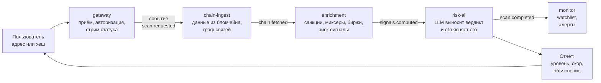

# risk-scoring — документация проекта

**Оценка риска криптоадресов с человекочитаемым объяснением от языковой модели.**

Пользователь вводит адрес кошелька или хеш транзакции — система сама идёт в блокчейн, собирает
историю переводов, строит граф связей, сверяет всех участников с санкционными списками, считает
риск-сигналы, отдаёт собранные доказательства языковой модели и возвращает вердикт
**LOW / MEDIUM / HIGH / CRITICAL** с числовым скором и объяснением, какие именно сигналы решили исход.

Плюс наблюдение: адрес можно поставить на watchlist, и система будет перепроверять его сама,
поднимая алерт при изменении уровня риска.

---

## Зачем это нужно

Обычный чат с языковой моделью не может ответить на вопрос «это скам-адрес?» — у него нет доступа
к ончейн-данным и к санкционным спискам. Он либо откажется, либо придумает ответ.

У нас доступ есть. Вся ценность продукта — в двух вещах:

1. **Собранные доказательства.** Реальная история переводов, граф контрагентов на два хопа,
   актуальный список OFAC SDN, курируемые списки миксеров и бирж.
2. **Рассуждение модели поверх них.** Не формула с весами, а взвешивание противоречивых сигналов
   с объяснением на человеческом языке.

Пример того, ради чего нужен второй пункт. У адреса одновременно: 34 % объёма прошло через миксер,
один хоп до санкционного адреса — но кошелёк старый, активный, половина контрагентов это hot-wallet
крупных бирж. Формула здесь либо даст ложное срабатывание, либо пропустит реальный риск. Модель
должна сказать, что именно перевесило и почему.

Отдельный содержательный момент, который система обрабатывает намеренно: **миксер — это не санкции.**
Tornado Cash убран из списка OFAC в марте 2025 (суд решил, что неизменяемые смарт-контракты
блокировать нельзя). «Адрес под санкциями» и «известный миксер, под санкциями не находящийся, но
всё ещё сигнал отмывания» — два разных утверждения с разными последствиями, и продукт их различает.

---

## Как это устроено сверху



Шесть независимых сервисов, которые **не вызывают друг друга напрямую**. Каждый слушает свою очередь
сообщений в Apache Kafka, делает свою часть работы и кладёт результат в следующую очередь.

Что это даёт:

- запрос пользователя возвращается мгновенно, а работа (несколько внешних API плюс вызов модели)
  идёт в фоне;
- падение одного сервиса не роняет цепочку — сообщения дождутся его возвращения;
- ручной скан пользователя и автоматическая перепроверка из watchlist используют **один и тот же
  конвейер**, без дублирования кода;
- каждый шаг конвейера транслируется в браузер в реальном времени — пользователь видит, как задача
  едет по системе, а не смотрит на спиннер.

| Сервис | За что отвечает |
|---|---|
| `gateway` | единственная точка входа: REST API, авторизация, WebSocket-стрим, история, биллинг |
| `chain-ingest` | данные из блокчейнов, граф контрагентов, кэш |
| `enrichment` | сверка со списками меток, расчёт риск-сигналов |
| `risk-ai` | промпт, вызов модели, валидация вердикта — **единственное место, где есть LLM** |
| `monitor` | watchlist, перепроверка по расписанию, алерты |
| `payment-watch` | приём оплаты в USDT напрямую из блокчейна |

---

## Что покрыто

| Область | Состояние |
|---|---|
| Сети | 9 EVM-сетей (Ethereum, BSC, Polygon, Arbitrum, Base, Optimism, Avalanche, Gnosis, Linea), Bitcoin, Solana, TRON, TON |
| Тип цели | адрес **или** хеш транзакции |
| Списки меток | OFAC SDN (автоматическая ежедневная синхронизация), миксеры и биржи (курируемые списки) |
| Аккаунты | регистрация с подтверждением e-mail, вход, refresh-токены, сброс пароля |
| Монетизация | 4 тарифа, оплата в USDT напрямую в блокчейне, квоты, API-ключи |
| Автоматизация | watchlist с перепроверкой каждые 6 часов и алертами |
| Качество | 150 тестовых классов, CI на каждый push, автодеплой после зелёного CI |

Что заявлено, но пока не сделано, — честно перечислено в [11-limitations.md](11-limitations.md).

---

## Технологии

**Бэкенд:** Java 25 · Spring Boot 4.1 · Spring Kafka · Spring Data JPA · Spring Security · Liquibase
**Данные:** PostgreSQL 17 (шесть схем, по одной на сервис) · Apache Kafka в режиме KRaft
**LLM:** DeepSeek по REST, провайдер заменяем
**Фронтенд:** React 19 · Vite · Tailwind 4 · Motion · STOMP-клиент
**Инфраструктура:** Docker Compose · Caddy (TLS) · GitHub Actions

---

## Оглавление

| Документ | О чём |
|---|---|
| [**OVERVIEW** — вся система одним файлом](OVERVIEW.md) | обзорная версия для чтения с нуля: архитектура, путь скана, данные, LLM, API, БД, стек, ограничения |
| [01. Архитектура: сервисы и Kafka](01-architecture.md) | границы сервисов, топики, надёжность, стандарты кода |
| [02. Как идёт скан](02-scan-pipeline.md) | **главный документ**: путь от ввода адреса до вердикта по шагам |
| [03. Откуда берутся данные](03-data-sources.md) | источники по сетям, кэш, построение графа связей |
| [04. Метки и риск-сигналы](04-signals-and-labels.md) | санкции, миксеры, биржи, эвристики, evidence bundle |
| [05. Ядро: LLM выносит вердикт](05-llm.md) | промпт, валидация, ретраи, что сохраняется |
| [06. API](06-api.md) | REST-эндпоинты, авторизация, WebSocket, коды ошибок |
| [07. Схема базы данных](07-data-model.md) | шесть схем, таблицы, правила миграций |
| [08. Watchlist, алерты и биллинг](08-monitor-and-billing.md) | автоперепроверка, тарифы, приём криптоплатежей |
| [09. Фронтенд](09-frontend.md) | экраны, живая консоль, дизайн-система |
| [10. Запуск и деплой](10-operations.md) | как поднять локально, переменные окружения, CI/CD, отладка |
| [11. Ограничения и что дальше](11-limitations.md) | честный статус и приоритеты доработки |

**Если читаете первый раз:** [OVERVIEW.md](OVERVIEW.md) — вся система на одной странице,
этого достаточно, чтобы понять её целиком. Дальше по темам — начиная с
[02. Как идёт скан](02-scan-pipeline.md).

---

## Быстрый старт

```bash
./dev.sh start     # Kafka + Postgres + 6 сервисов + фронтенд
# фронтенд  http://localhost:5173
# API       http://localhost:8081
# Kafka UI  http://localhost:8090
./dev.sh stop
```

Нужны JDK 25, Docker и Node 22, а также заполненный `.env` — список переменных в
[10-operations.md](10-operations.md).
